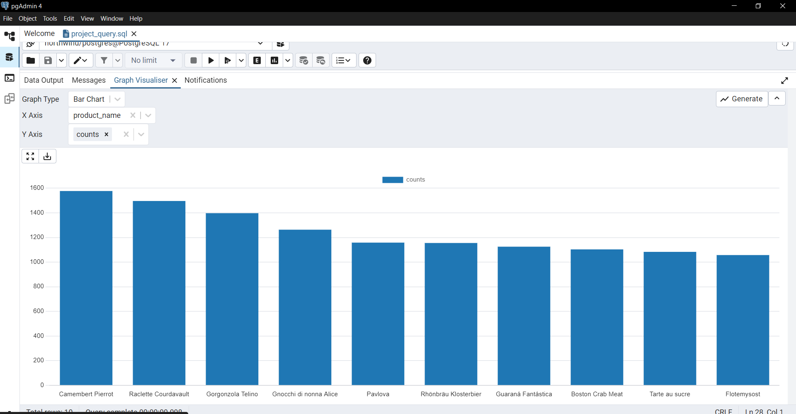
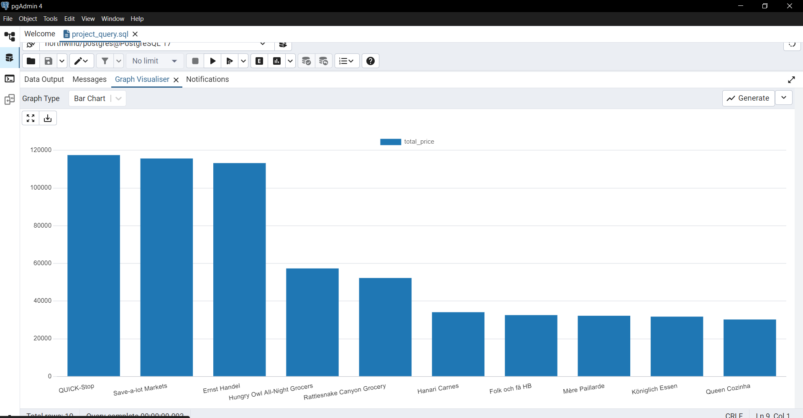
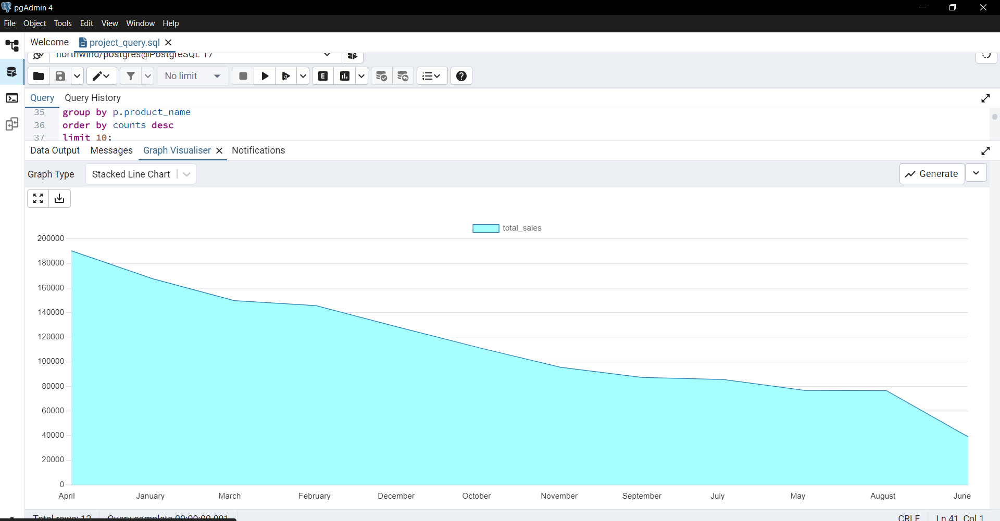
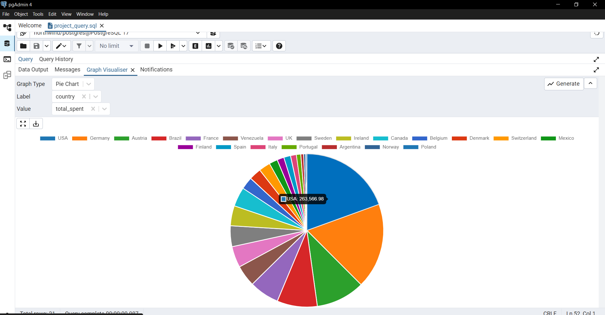
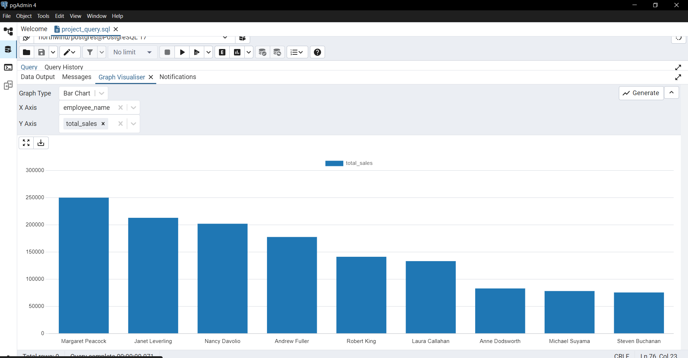
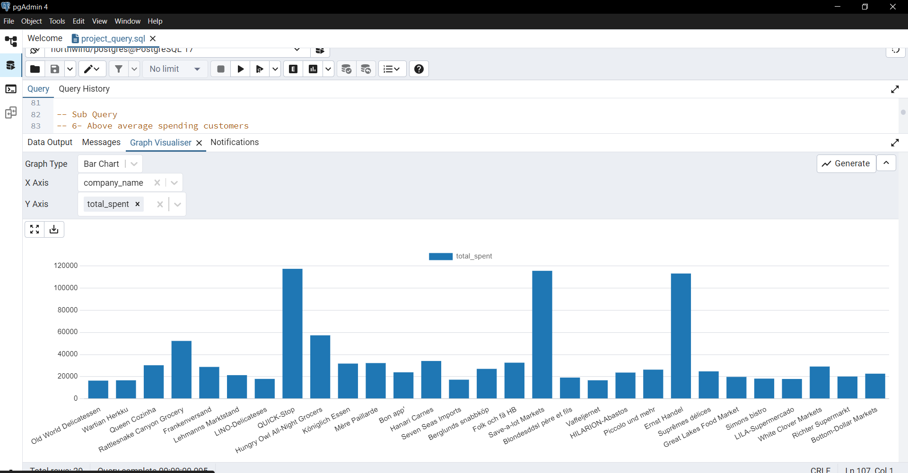

# 🗂️ Northwind Sales Analysis using SQL

## Introduction 
This project was created as part of my SQL learning journey to strengthen analytical skills and present business insights from relational data.

## 📖 Overview
This project analyzes the **Northwind Database** using **PostgreSQL** to practice SQL skills and extract meaningful business insights.  
It focuses on sales trends, customer behavior, employee performance, and product analysis.

The project was implemented in **one main SQL script** that contains all queries.

---

## 🎯 Objectives
- Practice advanced SQL queries (JOINs, Aggregations, Subqueries, CTEs, Window Functions).
- Derive **business insights** from sales data.
- Demonstrate ability to work with relational databases and analytical SQL.

---

## 🛠️ Tools & Technologies
- **PostgreSQL**  
- **pgAdmin / psql CLI**  
- **GitHub** for version control  

---

## 📊 Key Analyses & Insights
The project contains queries that answer questions like:
- 🏆 Who are the **top customers** by spending?
- 🌍 Sales distribution by **country** and **region**.
- 📅 Monthly sales performance and **running totals** over time.
- 📦 Best-selling products and categories.
- 👨‍💼 Employee performance (who generated the most sales?).
- 📈 Revenue growth trends.

---

## Query 

**-** Top 10 customers by purchase volume
**-** Top 10 Product sold
**-** Monthly sales trends
**-** Best spending countries
**-** Sales per Employee
**-** Above average spending customers
**-** Calculate monthly sales and then extract the highest month
**-** Customers ranked by spending within each country < window functions >
**-** Customers who purchased products from the "Seafood" category < Nested Query + IN >
**-** Create View 
**-** Running Total Sales
**-** Customer classification based on their spending < CASE Statement > 
Customers are divided into levels (VIP / Regular / Low Spender)
**-** Managers & Employees     < self join >

---

## ER Diagram and Tables 


---

## 📊 Visualizations & Insights

### 1. Top 10 customers by purchase volume


- **Insight:**
- The chart shows the Top 10 customers ranked by their total purchase volume. We can see that the first three customers have placed **over 1,200 orders** each, contributing disproportionately to overall sales and highlighting their critical role in the company’s revenue.

### 2. Top 10 Product sold


- **Insight:**
- The top 10 products show highly concentrated demand, with the first three exceeding 
100,000 orders each, making them the main revenue drivers.

### 3. Monthly sales trends


- **Insight:**
- Monthly sales peak during *January–April* (winter season), indicating higher demand in colder months.

### 4. Best spending countries


- **Insight:**
- The pie chart shows that *USA* and *Germany* together account for more than one-third of total sales spending, highlighting their dominant market share compared to other countries.

### 5. Sales per Employee


- **Insight:**
- Three employees achieved sales *above 200,000*, standing out as the top performers in the team

### 6. Above average spending customers


- **Insight:**
- Several customers spent above the overall average, with a few significantly exceeding it, making them key high-value clients.

---

## 📂 Project Structure
- `northwind_project.sql` → Contains all queries used in the analysis.  
- `images/` → Visualizations or charts generated from results.  

---

## 🚀 How to Run
1. Clone the repository:
   ```bash
   git clone https://github.com/username/northwind-sql-analysis.git
